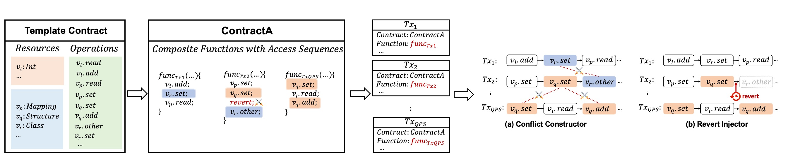

# Chord

Recently emerged blockchain systems have implemented various transaction parallel scheduling mechanisms to improve the system throughput and reduce the latency. However, these mechanisms inevitably introduce bugs. Such bugs can result in severe consequences such as asset loss, double spending, consensus failure, and DDoS. Unfortunately, they have been little analysed about their symptoms and root causes, leading to a lack of effective detection methods. 
In this work, we conduct a thorough analysis of historical transaction parallel scheduling bugs in four commercial blockchains. Results show that most of them arise from mishandling conflict transactions and manifest without obvious phenomena. However, given the heterogeneity of blockchains, it is challenging to trigger conflict handling in a unified way. Effectively identifying these bugs is also hard. Inspired by the findings, we propose Chord, aiming at detecting blockchain transaction parallel scheduling bugs. The key insight of Chord is constructing a unified conflict transaction model to generate conflict resource accesses and proactive reverts. Therefore, Chord triggers the error-prone conflict handling scenarios and effectively triggers the bugs. Besides, Chord incorporates a localremote differential oracle and a TPS oracle to capture the bugs. Our evaluation shows that Chord successfully detected 54 bugs, including 10 previously unknown ones. Chord outperforms the existing methods by decreasing the TPS by 49.7% and increasing the latency by 388.0%, showing its effectiveness in triggering various conflict handling scenarios and exposing the bugs.

## Repo Structure

To help users understand the repository structure of Chord, we provide the following explanation:

Source Code:

- **Aptos**: The source code for Chord's implementation on Aptos is located in `Source Code/Aptos/Chord/`. The other files under `Source Code/Aptos/` are for auxiliary testing purposes.
- **FISCO BCOS**: Chord uses FISCO BCOS's official Java SDK to assist its implementation. The source code is located in `Source Code/FISCO BCOS/java-sdk-demo/src/main/java/org/fisco/bcos/sdk/demo/fuzz/`, while the other files belong to the official FISCO BCOS JDK.
- **Sei**: The source code for Chord's implementation on Sei is located in the `Source Code/Sei/src/main/java/org/example/` folder. All files in this folder are related to Chord.
- **Solana**: The code for Chord's implementation on Solana is primarily located in `Source Code/Solana/tests/`. Files under `Source Code/Solana/ts/` include helper classes and functions related to the main functions.

Experiment Data:

- All experimental data is located in the `Evaluation Data` directory.

## Experiment Data

The experimental data is stored in the following locations:  
`Evaluation Data/${project_name}/noConflict_tps.log`,  
`Evaluation Data/${project_name}/stress_tps.log`,  
`Evaluation Data/${project_name}/tps.log`.

- `noConflict_tps.log` contains the TPS and latency data for the no-conflict version of Chord, as mentioned in the paper.
- `stress_tps.log` contains the TPS and latency data from the official test scripts.
- `tps.log` contains the TPS and latency data for Chord.

## Design Details

#### The Conflict Transaction Generation Process

The process of conflict transaction generation is shown in the figure below.



In a test round, Chord instantiates the template contract (e.g. ContractA) to generate a number of **composite functions** that randomly calls a series of access operations and inserts proactive reverts among them. Each transaction calls one of these composite functions. Chord generates a bunch of transactions for a test round. If transactions access the same variables, the conflict occurs.

## Experiment Details

#### The effectiveness of the template contract

The template contract aggregates various resources and access operations to generate conflict scenarios, improving Chord’s effectiveness to trigger TPBs. In contrast, using real-world contracts directly can limit conflict patterns and produce many non-conflict transactions, which reduces test effectiveness. 

We evaluated Chord on real-world contracts provided by the targeted blockchains. For FISCO BCOS, we applies the contracts in its official stress testing framework. For Sei, Solana and Aptos, we employ their provided example test contracts. We found that, under the same QPS, its TPS is 34.82\% higher and latency is 52.35\% lower than using the template contract. Besides, it only detects 7 TPBs. This demonstrates the effectives of the template contract.


## Quickstart

### Chord for FISCO BCOS

#### prerequisites

Setup fisco network environment, can be found in https://fisco-bcos-doc.readthedocs.io/zh-cn/latest/docs/quick_start/air_installation.html

#### setup FISCO BCOS testnet & start testing

1.Running 4 node private chain 
2.Enable sharding

```
FISCO-BCOS/console/console.sh setSystemConfigByKey feature_sharding 1
```

3.Compile the Java file and run it

```
cd ./FISCO BCOS/java-sdk-demo
./gradlew goJF
bash gradlew build
cd dist
java -cp 'conf/:lib/*:apps/*' org.fisco.bcos.sdk.demo.fuzz.Main
```


### Chord for Sei

#### prerequisites


Setup Sei network environment, can be found in https://www.docs.sei.io/

#### setup Sei testnet & start testing

1.Running 4 node private chain 
2.Compile the Java file (if its name is sei.jar) and run it

```
cd Sei
java -jar sei.jar
```


### Chord for Aptos

#### prerequisites

Setup Aptos network environment, can be found in https://aptos.dev/en/build/get-started

#### setup Aptos testnet & start testing

1.Running 4 node private chain

2.Run the python script to test

```
cd Aptos/Chord
python3 fuzz.py
```


### Chord for Solana

#### prerequisites

Setup Solana network environment, can be found in https://solana.com/docs

#### setup Solana testnet & start fuzzing

1.Running 4 node private chain
2.Run the python script to test

```
cd Solana
npm run test
```

